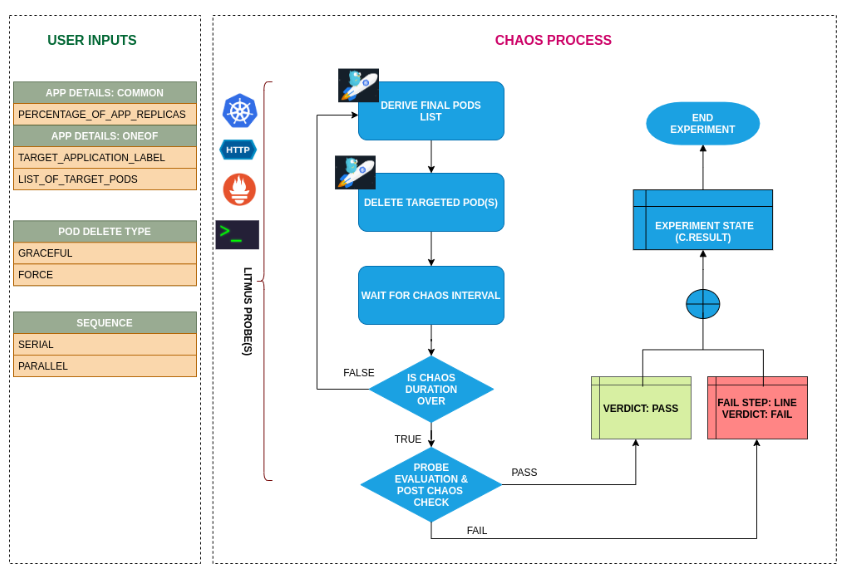

# ChaosEngineering
A repo for experimenting and work on chaos engineering

**1.1. Overview of Chaos Engineering**
  **What is Chaos Engineering?**
  Chaos Engineering is a disciplined approach to testing the resilience of systems in production by intentionally introducing controlled faults and failures. The    goal is to identify vulnerabilities and weaknesses in the system before they manifest in real-world scenarios, ensuring that the system can recover gracefully     and continue to meet business requirements.
  Key Principles of Chaos Engineering
  **Start Small:**
  Begin with small, controlled experiments on non-critical components to understand the impact.
  
  **Automate Experiments:**
  Use tools like LitmusChaos, Gremlin, or Chaos Monkey to automate fault injection and monitoring.
  
  **Build Hypotheses:**
  Before running experiments, predict how the system will behave under specific failures.
  
  **Run in Production-Like Environments:**
  Ensure experiments mimic real-world environments to get accurate results.
  
  **Minimize Blast Radius:**
  Scope experiments to reduce risk and ensure quick recovery.
  
  **Why Chaos Engineering?**
  
  * Improves Resilience:
  Helps organizations build robust systems capable of handling unexpected failures.
  
  * Validates Redundancy Mechanisms:
  Ensures failover systems, backups, and auto-scaling work as expected.
  
  * Boosts Confidence:
  Teams gain confidence in deploying changes and handling emergencies.
  
  * Encourages Proactive Problem-Solving:
  Helps identify issues before they cause outages or customer impact.
  
  **Common Chaos Engineering Scenarios**
  
  * Pod/Service Failures:
    Simulate failures in microservices or Kubernetes pods.
  
  * Network Latency:
    Inject latency or packet loss to observe the system's behavior under network disruptions.
  
  * Resource Starvation:
    Decrease CPU, memory, or disk availability to test resource management.
  
  * Database Downtime:
    Simulate database outages to test system failover.
  
  **Steps in Chaos Engineering**
  
  * Define the System’s Steady State:
    Determine key metrics that define the system's normal functioning (e.g., API response time, throughput).
  
  * Create a Hypothesis:
    Example: If a pod is deleted, Kubernetes should recreate it within 5 seconds without impacting the service.
  
  * Introduce Failures:
    Use tools to inject failures (e.g., delete a pod, throttle network bandwidth).
  
  * Observe and Measure:
    Monitor the impact of the chaos experiment using metrics, logs, or alerts.
  
  * Learn and Improve:
    Document findings and improve the system's resilience.
  
  Chaos Engineering in Kubernetes
  
  Kubernetes provides native self-healing capabilities, making it an ideal environment for Chaos Engineering. For example:
  
  Kubernetes automatically restarts failed pods.
  It redistributes workloads when nodes fail.
  Tools like LitmusChaos extend these capabilities to simulate real-world failure scenarios.
**1.2. Overview of Tools and Technologies**
**1.2.1. FastAPI**
* What is it?
    FastAPI is a modern, fast (high-performance) web framework for Python, built on standard Python type hints. It's designed to be easy to use while being suitable for production-grade applications.
* Why FastAPI?
    Auto-generated interactive API docs.
    Built-in validation and serialization.
    High-performance due to Starlette and Pydantic.
* Docker
    What is it?
    Docker is a platform for developing, shipping, and running applications in containers. Containers are lightweight and include all dependencies needed to run an application.
* Why Docker?
    Consistent environment across development, testing, and production. 
    Simplifies dependency management.
    Makes deployment faster and more reliable.
* Kubernetes
    * What is it?
      Kubernetes (K8s) is an open-source platform for automating the deployment, scaling, and management of containerized applications.
    * Why Kubernetes?
      Provides features like auto-scaling, load balancing, and rolling updates.
      Ensures high availability and fault tolerance.
      Self-healing capabilities (e.g., automatic restart of failed containers).
* LitmusChaos
    * What is it?
      LitmusChaos is an open-source Chaos Engineering platform that helps test the resilience of Kubernetes environments by introducing disruptions.
    * Why LitmusChaos?
      Native Kubernetes integration.
      Allows you to simulate real-world failure scenarios.
    * Provides detailed reports and metrics for resilience analysis.
**1.3. Development and Setup**
**1.3.1. Step 1: FastAPI Application Development**
    Created a simple FastAPI app with endpoints for testing.
    Added Swagger UI for interactive API documentation
**1.3.2. Step 2: Containerizing FastAPI with Docker**
    Created a Dockerfile to containerize the app:
    Built and tested the Docker image locally:
**1.3.3. Step 3: Deploying FastAPI on Kubernetes**
    Wrote Kubernetes deployment and service YAML files:
    Deployment:
    fastapi-deployment.yaml

    Service:
    fastapi-service.yaml

    Verified deployment and exposed service:

    kubectl get pods -n fastapichaos kubectl get svc -n fastapichaos

**1.4. Setting Up LitmusChaos**
**1.4.1. Step 1: Install LitmusChaos**
Installed LitmusChaos CRDs and control plane in Kubernetes:
https://docs.litmuschaos.io/docs/getting-started/installation/

Verified installation:

kubectl get pods -n litmus

**1.5. Creating and Running a Chaos Experiment**
**1.5.1. Configured Environment in the litmuschaos ui**

**1.5.2. Created the Pod-Delete Chaos Experiment:**

**1.5.3. Configured the Chaos Engine:**
**1.5.4. Executed the Experiment:**

**1.6. Observations and Outcomes**
**1.6.1.  Chaos Experiment Execution**
    Pods of the FastAPI app were intentionally deleted by the chaos engine.
    Kubernetes automatically restarted the deleted pods due to deployment configurations.
**1.6.2. Monitoring Application Health**
    Configured LitmusChaos HTTP probes to monitor FastAPI endpoints.
    Application health was monitored using probes
**1.6.3. Key Learnings**
    Verified application resilience under failure scenarios.
    Demonstrated Kubernetes self-healing capabilities.
    Successfully integrated monitoring and Chaos Engineering.
**1.7. Tools and Commands Summary**
    FastAPI Application Development:
    Docker:
    Kubernetes:
    LitmusChaos:
